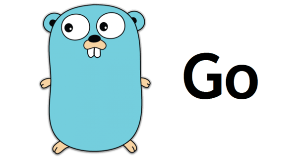

# Golang



# Sumario
1. [Por que aprender](#por-que-aprender?)
2. [Análise da LP](#análise-da-lp)
3. [Códigos de exemplo](#códigos-de-exemplo)

## Por que aprender?


* O Google criou o Golang para resolver os problemas que eles encaram na empresa.
  * Programas complexos usados para softwares de servidores grandes que funcionavam em cima de grandes clusters(vários servidores funcionando entre si).

  

  * Antes era usado o C++ e o Java, mas elas não tinha uma fluidez e capacidade de escrita adequada para programas de tal escala.
  * Levando esses fatores em consideração, Ken Thompson e  Robert Griesemer idealizaram o golang para resolver esses problemas.

  
  
  Figura: Robert Griesemer à esquerda e Ken Thompson à direita

* Direcionado a programas de grandes complexidade e escala, ou que exigiriam eficiencia e um código de grande escalabilidade(i.e, um programa que funciona bem mesmo com uma grande quantidade de dados envolvida; e.g., programas de complexidade linear O(n)).

* Por ser uma linguagem nova e adaptada aos recursos modernos amplamente difundidos no panorama de ambientes de programação atuais, e.g. networking, complexos clusters de computadores, e clouds(nuvem); ela é capaz de suprir e se integrar diretamente a essas novas tecnologias ao contrário de outras linguagens antigas de 10 ou 20 anos atrás.

* ***Eficiencia***: capacidade de funcionar em milhares de máquinas ao mesmo tempo e pouco desperdício de recursos que ocorreriam em implementações de máquinas virtuais.

* Desse modo, com essas qualidade, o Golang se tornou um modelo bastante prezada pela comunidade de desenvolvedores.

## Análise da LP

* Tipo de linguagem: Imperativa e compilada.

### Capacidade de escrita

### Legibilidade

### Custo

### Confiabilidade

## Códigos de exemplo

### Hello world

#### Golang

``` go
package main

import  "fmt"

func main (){

  fmt.Println("Hello world!")
}

```

#### C

``` C
#include <stdio.h>

int main (){
  printf("Hello World!");

  return 0;
}

```

### Variables

#### Golang

``` go
package main

import "fmt"

func main(){
  var a int = 3
  var b float32 = 1.35

  const pi = 3.1415189475

  u,v := 10,2

  fmt.Println(a)
  fmt.Println(b)
  fmt.Println(pi)
  fmt.Println(u)
  fmt.Println(v)
}
```

#### C

``` C

#include <stdio.h>

int main(){
  int a = 3;
  float b = 1.35;

  const double pi = 3.1415189475;

  int u = 10;
  int v = 2;

  printf("%d\n", a);
  printf("%.2f\n", b);
  printf("%.10f\n", pi);
  printf("%d\n", u);
  printf("%d\n", v);

  return 0;
}

```

### Operations

#### Golang

``` go
package main

import "fmt"

func main() {
  x,y := 5,3

  fmt.Println("x + y = ", x+y)
  fmt.Println("x - y = ", x-y)
  fmt.Println("x * y = ", x*y)
  fmt.Println("x / y = ", x/y)
  fmt.Println("x mod y = ", x%y)

  varbool := true
  otherbool := false

  // Equivalente da declaração e definição anterior:
  //    var varbool bool = true
  //    var otherbool bool = false

  /*
    Aliás, os comentarios são iguais ao C.
  */

  fmt.Println(varbool && otherbool)
  fmt.Println(varbool || otherbool)
  fmt.Println(!(varbool) == otherbool)
}


```

#### C

``` C

#include <stdio.h>
#include <stdbool.h>

int main() {
  int x = 5;
  int y = 3;

  printf("x + y = %d\n", x+y);
  printf("x - y = %d\n", x-y);
  printf("x * y = %d\n", x*y);
  printf("x / y = %d\n", x/y);
  printf("x mod y = %d\n", x%y);

  // Declaração tipada
  bool varbool = true;
  bool otherbool = false;

  // C é incapaz de imprimir tipos booleanos
  printf(varbool && otherbool? "true" : "false");
  printf("\n");
  printf(varbool || otherbool? "true" : "false");
  printf("\n");
  printf(!(varbool) == otherbool?"true" : "false");
  printf("\n");

  return 0;
}

```

### Pointers

``` go
package main

import "fmt"

func main() {

  x := 10
  var y *int = x

  // Semelhante ao C
  fmt.Println(x)
  fmt.Println(*y)
}
```

``` C

#include <stdio.h>

int main() {
  int x = 3;
  int* y = &x;

  printf("%d", x);
  printf("%d", *y);

  return 0;
}
```
### Print

``` go
package main

import "fmt"

func main() {

  // No C isso não é possível
  var name string = "Some text"
  name += " more text"
  win := true
  const pi float64 = 3.141592

  // O printf

  // Equivale ao printf do C
  // Formatação um pouco mais flexivel
  fmt.Printf("%d \n", 3)

  fmt.Printf("%s \n", name)

  // C não exibe booleanos
  fmt.Printf("%t \n", win)

  // C não é capaz de printar binarios
  // com seus recursos primarios
  fmt.Printf("%b \n", 12)

  // Iguais ao C
  fmt.Printf("%c \n", 34)
  fmt.Printf("%X \n", 12)
  fmt.Printf("%e \n", pi)
}
```

``` C

#define BYTE_TO_BINARY_PATTERN "%c%c%c%c%c%c%c%c"
#define BYTE_TO_BINARY(byte)  \
  (byte & 0x80 ? '1' : '0'), \
  (byte & 0x40 ? '1' : '0'), \
  (byte & 0x20 ? '1' : '0'), \
  (byte & 0x10 ? '1' : '0'), \
  (byte & 0x08 ? '1' : '0'), \
  (byte & 0x04 ? '1' : '0'), \
  (byte & 0x02 ? '1' : '0'), \
  (byte & 0x01 ? '1' : '0')

#include <stdio.h>
#include <string.h>
#include <stdbool.h>

int main() {

  // Problemas: tamanho limitado na string final
  char a[50] = "Some text";
  char *b = " more text"; 

  bool win = true;

  float pi = 3.141592;

  strcat(a,b);

  printf("%d \n", 3);

  printf("%s\n", a);

  printf(win? "true" : "false");
  printf("\n");

  printf(BYTE_TO_BINARY_PATTERN, BYTE_TO_BINARY(12));
  printf("\n");

  printf("%c \n", 34);
  printf("%X \n", 12);
  printf("%e \n", pi);

  return 0;
}

```

### Loop

``` go
package main

import "fmt"

func main() {

  // Loop For
  for i:= 1, i<= 10, i++{
    fmt.Println(i)
  }

  // Loop while
  j := 1
  for j <= 10 {
    fmt.Println(j)
    i++
  }

  // Loop infinito
  //  for {
  //  
  //  }
}
```

``` C
#include <stdio.h>

int main() {
  for (int i = 1; i <= 10; i++){
    printf("%d\n", i);
  }

  int j = 1;

  while(j<= 10){
  printf("%d\n", j);
  j++;
  }

  return 0;

}
```

### Array

``` go
package main

import "fmt"

func main() {

  // Declaracoes de array
  // Forma 1
  // var A[5] int

  // Forma 2
  B := [5]int{0,1,2,3,4}

  // Percorrer array
  for i, value := range B {
    fmt.Println(value, i)
  }

  // Slices - arranjos dinamicos e referencias a arrays

  // Forma 1
  
  Slice := []int{0,1,2,3,4}

  sub := Slice[2:4]
  fmt.Println(sub)

  // Forma 2(tipo, tamanho, capacidade)
  sub2 := make([]int, 5, 10)

  copy(sub2, Slice)

  fmt.Println(sub2)

  sub3 := append(Slice,2,-3,0)
  fmt.Println(sub3)
}
```

``` C
#include <stdio.h>
#include <stdlib.h>
#include <string.h>


int main() {

  int B[5] = {0,1,2,3,4};
  int size = sizeof(B)/sizeof(B[0]);

  for(int i = 0; i < size; i++){
    printf("%d %d\n", B[i], i);
  }

  // Não há arranjos em C. Mas a implementação ficaria
  // parecido com esse trecho
  int* sub[5];
  sub[0] = &(B[2]);
  sub[1] = &(B[3]);

  printf("[");
  printf("%d %d", *sub[0], *sub[1]);
  printf("]\n");


  // Copy array
  int* sub2[5];
  for(int i = 0; i < size; i++){
    sub2[i] = &B[i];
  }

  printf("[");
  printf("%d", *sub2[0]);

  for(int i = 1; i < size; i++){
    printf(" %d", *sub2[i]);
  }
  printf("]\n");

  int C[3] = {2,-3,0};
  int* sub3 = malloc(8*sizeof(int));

  memcpy(sub3, B, 5*sizeof(B[0]));
  memcpy(sub3+5, C, 3*sizeof(C[0]));

  printf("[");
  printf("%d", sub3[0]);
  for(int i = 1; i < 8; i++){
    printf(" %d", sub3[i]);
  }
  printf("]\n");

  
  return 0;

}

```